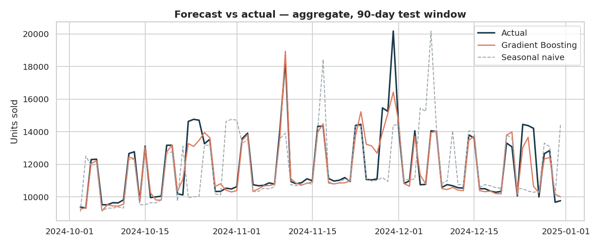
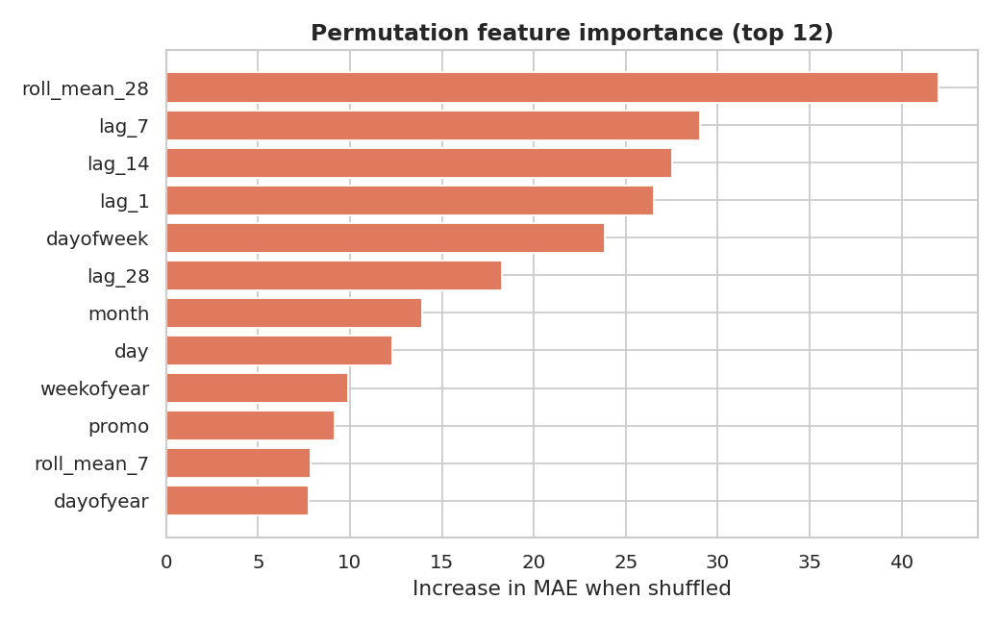
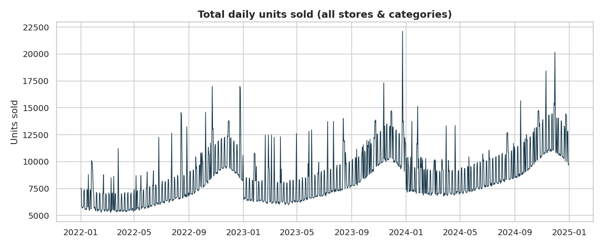
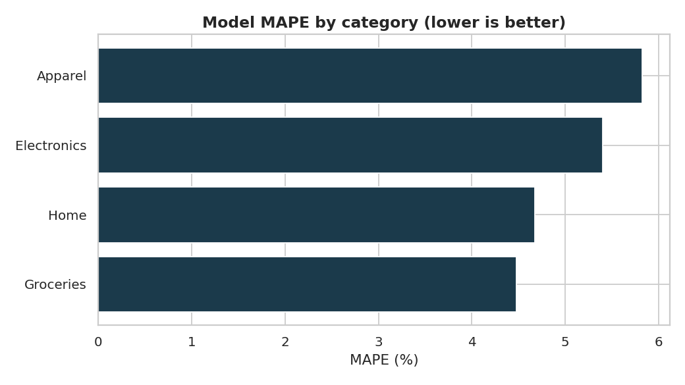

# 📈 Sales Forecasting Analytics Platform

Daily demand forecasting across multiple retail stores and product categories, with
an interactive dashboard for exploring history and projecting future sales.


---

## Overview

Retailers need to know *how much they'll sell, where, and when* to plan inventory and
staffing. This project builds an end-to-end pipeline that learns weekly and yearly
seasonality, promotions, and holiday spikes from historical sales and forecasts demand
for any store/category up to 90 days ahead.

A gradient boosting model is benchmarked against a seasonal-naive baseline, and the
results are served through an interactive Streamlit dashboard.

## Results

Evaluated on a **held-out 90-day window** (the most recent dates were never seen during
training), the model reduces forecast error by more than half versus the baseline:

| Metric | Seasonal-naive baseline | Gradient Boosting | Improvement |
|--------|------------------------:|------------------:|------------:|
| MAE    | 70.49 | **31.86** | **−54.8%** |
| RMSE   | 120.80 | **51.48** | −57.4% |
| MAPE   | 11.34% | **5.09%** | −55.1% |

> The model achieves **~5% MAPE**, meaning forecasts land within about 5% of actual
> daily units on average.

### Forecast vs actual (90-day test window)
The model (orange) tracks real demand closely, including the weekly cycle and the
year-end holiday spike, while the seasonal-naive baseline (grey) lags the pattern.



### What drives the forecast
Permutation importance shows recent demand (lags and rolling means) and the weekly
cycle carry the most signal.



### Demand over time & error by category
| Historical demand | Accuracy by category |
|---|---|
|  |  |

## How it works

**Data** — A realistic synthetic dataset (`data/generate_data.py`) of ~22k daily records
across 5 stores × 4 categories over 3 years, built from interpretable components: trend,
weekly seasonality, yearly/holiday seasonality, promotions, and noise. Swap in a real
CSV with the same schema (`date, store, category, promo, units_sold`) to use your own data.

**Feature engineering** (`src/features.py`) — Calendar features (day-of-week, month,
weekend flags), lag features (1, 7, 14, 28 days), and rolling mean/std (7, 28 days). All
time features are shifted to prevent target leakage from future values.

**Models** (`src/train.py`)
- *Baseline*: seasonal-naive — predict the value from 7 days earlier.
- *Model*: `HistGradientBoostingRegressor` with native categorical support, evaluated on
  a strict time-based split (no shuffling).

**Multi-step forecasting** (`src/forecast.py`) — The one-step model is rolled forward
recursively: each prediction is fed back as a lag to forecast the next day, enabling
arbitrary horizons.

**Dashboard** (`dashboard/app.py`) — Streamlit app to pick a store/category, view KPIs and
history, choose a horizon, and download the forecast as CSV.

## Project structure

```
sales-forecasting-analytics-platform/
├── data/
│   └── generate_data.py      # builds the synthetic dataset
├── src/
│   ├── features.py           # feature engineering (no leakage)
│   ├── models.py             # model factory + baseline definition
│   ├── evaluate.py           # MAE / RMSE / MAPE
│   ├── forecast.py           # recursive multi-step forecasting
│   └── train.py              # full pipeline: train, evaluate, plot
├── dashboard/
│   └── app.py                # Streamlit dashboard
├── reports/figures/          # generated charts (committed for the README)
├── requirements.txt
└── README.md
```

## Quickstart

```bash
# 1. Clone and set up
git clone https://github.com/kattakeerthnareddy/sales-forecasting-analytics-platform.git
cd sales-forecasting-analytics-platform
python -m venv .venv && source .venv/bin/activate   # Windows: .venv\Scripts\activate
pip install -r requirements.txt

# 2. Generate the dataset
python data/generate_data.py

# 3. Train, evaluate, and produce figures
python src/train.py

# 4. Launch the interactive dashboard
streamlit run dashboard/app.py
```

## Tech stack

Python · pandas · NumPy · scikit-learn · Matplotlib · seaborn · Streamlit

## Roadmap

- [ ] Add a probabilistic forecast (prediction intervals)
- [ ] Benchmark against Prophet / LightGBM
- [ ] Hyperparameter tuning with time-series cross-validation
- [ ] Containerize and deploy the dashboard

## License

Released under the [MIT License](LICENSE).
